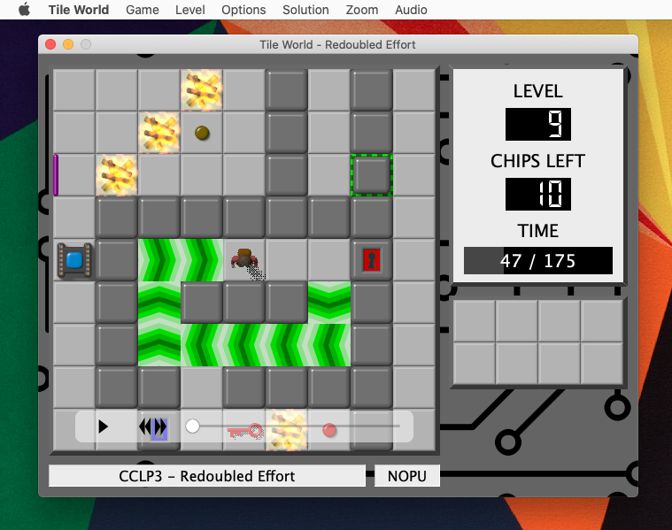

# Tile World

Experimental version of Tile World for Mac, Windows and Linux. Tile World is an emulation of the game “Chip’s Challenge” for the Atari Lynx, created by Chuck Sommerville, and subsequently ported to Windows.

This is a fork of a fork or a fork. The original Tile World was written by Brian Raiter. Madhav Shanbhag created a fork of version 1.3.0 using the Qt Library and called it Tile World 2, although Brian Raiter subsequently produced a version 1.3.2 of the original.

The is a fork of Tile World 2.2.0 (the highest version I could find). I originally started it so I could get an 64-bit executable for Mac, but have added in a few UI improvements on the way, along with removing some of the older code.

## Migrating from and existing installation

I would strongly recommend you backup everything first!

The settings/solutions directory has moved from `~/.tworld` to:

| Path | OS |
| --- | --- |
| `~/Library/Application Support/Tile World` | on Mac |
| `~/AppData/Roaming/Tile World` | on Windows, and |
| `~/.local/share/Tile World` | on Linux. |

This follows the [`QStandardPaths::AppDataLocation`](https://doc.qt.io/qt-5/qstandardpaths.html) variable which in turn follows each OS’s conventions.

If you wish to migrate from an existing Tile World 2 installation, copy your files to appropriate directory and move your solution `.tws` files to a `solutions` sub directory. This version is more exacting then Tile World 2.2: the `.dac` must be in the `sets` sub-directory while any `.dat` files you wish to install should be placed in a `data` sub-directory. (For example if you have a chips.dat file, you should put it in `~/Library/Application Support/Tile World/data` on Mac.)

## To Compile

To compile and run it you need [qt](https://www.qt.io/) and [SDL](https://www.libsdl.org/) (version 1 or 2) which can be installed via [Homebrew](https://brew.sh/).

To compile just run `./make.pl` from the command line.

`./make.sh install` will (hopefully) create an app bundle and move it to the /Applications folder.

## Copyright

This version is from: https://github.com/mjfwalsh/tworld

Original source from: https://tw2.bitbusters.club/

Copyright &copy; 2001-2022 by Brian Raiter, Madhav Shanbhag, Eric Schmidt and Michael J Walsh

Released under GNU General Public License version 2 and above.

The sound effects were created by Brian Raiter, using [SoX](https://sox.sourceforge.net/). They have been released into the public domain.

The tile images were created by Anders Kaseorg, using [POV-Ray](https://www.povray.org/). They have also been released into the public domain.
